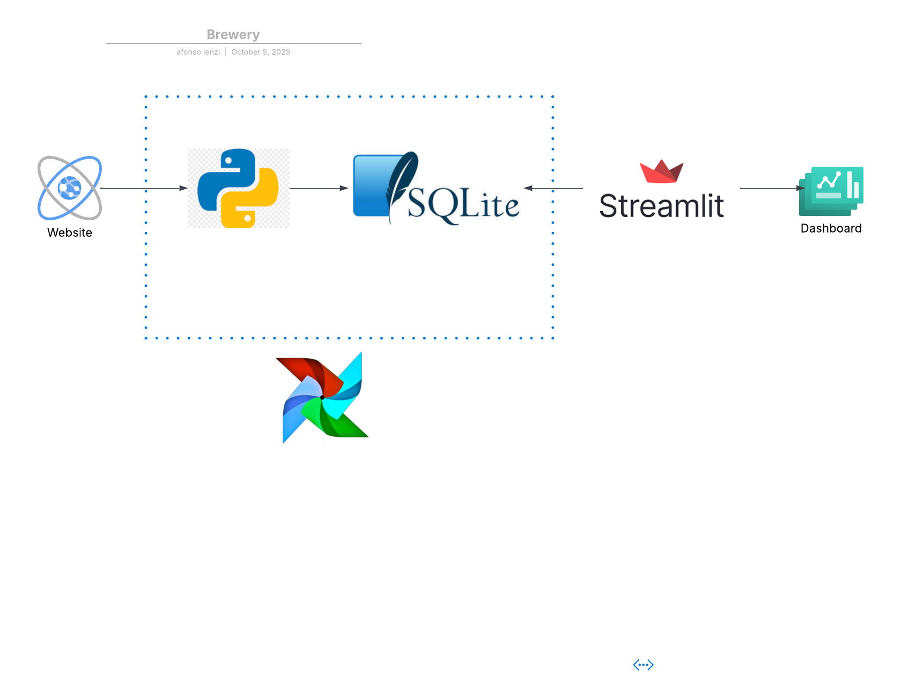

# brewery

This project implements a modern, scalable ETL pipeline to ingest data from the public OpenBreweryDB API. The pipeline is orchestrated by Apache Airflow, processed with Apache Spark, and stored in a MinIO-based data lake using the Delta Lake format. The entire environment is containerized with Docker Compose for portability and ease of deployment.

The pipeline follows the Medallion Architecture to progressively refine and structure the data across Bronze, Silver, and Gold layers, making it suitable for analytics and business intelligence.

Technology Stack

Orchestration: Apache Airflow

Data Processing: Apache Spark

Data Lake Storage: Sqllite

Dashboard? Streamlit

Containerization: Docker Compose

## How to Run This Project 🚀
Follow these steps to get the pipeline and dashboard running on your local machine.

### 1. Clone the Repository
First, clone the project from GitHub and navigate into the project directory.

Bash

git clone https://github.com/afonsolenzi/brewery/
cd brewery
### 2. Start the Airflow Environment
Use the Astro CLI to build the Docker image and start all necessary Airflow services.

Bash

astro dev start
✨ Note: The first time you run this command, it may take several minutes to download the base Docker image. Subsequent runs will be much faster.

### 3. Run the Airflow DAG
Once the environment is running, you need to trigger the data pipeline.

Open your web browser and go to http://localhost:8080.

Log in with the default credentials:

Username: admin

Password: admin

Find the DAG named brewery_api_to_sqlite_poc.

Enable the DAG by clicking the toggle switch next to its name.

Trigger the DAG by clicking the "play" (▶️) button on the right.

Wait for the DAG run to complete successfully (it will show a green circle). When it's done, a file named brewery.db will be created in the include/data/ folder of your project.

### 4. View the Dashboard 📊
With the data processed, you can now launch the local Streamlit dashboard to view the results.

Open a new terminal window, navigate to the project folder, and run:

Bash

streamlit run dashboard.py
This will automatically open a new tab in your browser displaying the interactive dashboard.

## Stopping the Environment 🛑
To shut down all the Docker containers related to this project, go back to your terminal where you ran astro dev start and press Ctrl + C, or run the following command from the project directory:

Bash

astro dev stop
